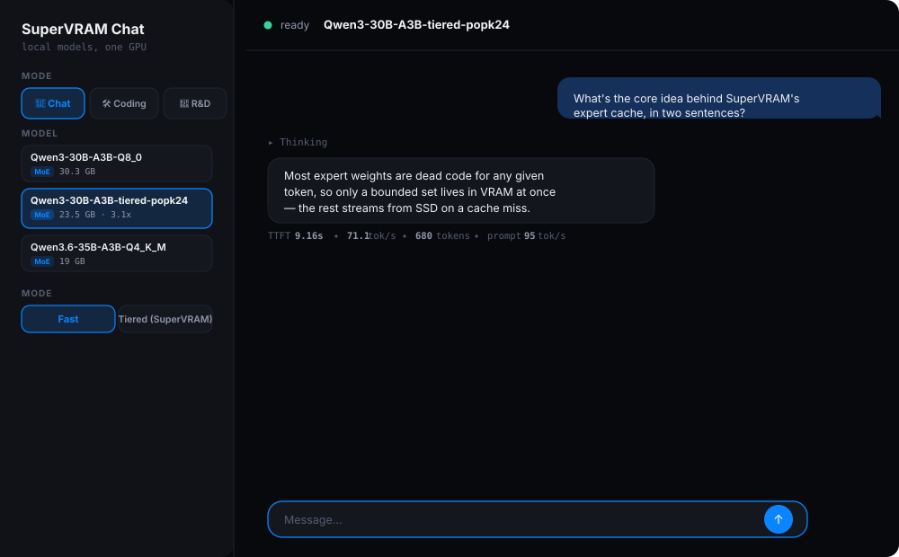

# SuperVRAM

**Run mixture-of-experts LLMs larger than your GPU's VRAM — on one consumer GPU.**

A VRAM + RAM + SSD expert cache for MoE inference, built as a llama.cpp fork, with a local chat
UI on top. Every number below is measured on real hardware and verified bit-exact against
full-GPU execution before it's trusted — including the one result that came back negative.

<p>
  
  
  
  
</p>

---

<p align="center">
  
</p>

<p align="center"><sub>The local chat UI, showing the model picker (the tiered-precision model selected, 23.5&nbsp;GB / 3.1&times; badge), a live reply, and real per-turn metrics pulled straight from <code>llama-server</code>'s own timings — not estimated.</sub></p>

---

## Why this exists

A mixture-of-experts model like Qwen3-30B-A3B has 48 layers of 128 experts each — but only 8
experts fire per token per layer. Its full weights don't fit in a 24&nbsp;GB consumer GPU, but at
any given moment, most of those weights are dead code. SuperVRAM exploits that: a bounded set of
expert slots lives in VRAM, backed by direct-I/O reads from SSD on a cache miss, with pluggable
LRU/LFU eviction — so a model 2-3&times; larger than your VRAM still runs, and the parts that
matter stay fast.

This is the exact feature [an open, unanswered llama.cpp issue](https://github.com/ggml-org/llama.cpp/issues/20757)
has been asking for.

## Results at a glance

Two pieces of real, measured work sit on top of the core cache. Full methodology, gates, and
artifacts for both are in **[the full report](supervram/docs/REPORT.html)** — open it directly in
a browser, no build step needed.

### 1. Popularity-tiered precision — a real 3.1&times; win

Not all layers are equal, so don't quantize them equally. 24 of 48 layers are downgraded to
4-bit, selected by an entropy signal computed from real routing traces — not an arbitrary split.

| Configuration | Decode t/s | Hit rate | SSD read | Quality vs Q8_0 |
|---|---:|---:|---:|---:|
| Q8_0 baseline | 26.30 | 97.4% | 76.69 GB | &mdash; |
| Arbitrary 24/24 split | 65.85 | 98.9% | 27.19 GB | +0.71% PPL |
| **Popularity-tiered (K=24)** | **83.25** | **99.1%** | **20.04 GB** | **+0.73% PPL** |

**3.1&times; over Q8_0, 1.26&times; over an equally-sized arbitrary split** — at the same model
size and same cache budget, so the gain is attributable entirely to *which* layers were chosen.
Four correctness gates (byte accounting, router-tensor exactness, teacher-forced quality,
measured throughput) all pass before this number is trusted — see
[`docs/SPEC_IDEA1_POPULARITY_TIERED_PRECISION.md`](supervram/docs/SPEC_IDEA1_POPULARITY_TIERED_PRECISION.md).

### 2. Confidence-gated speculative prefetch — ported to C++, honestly regressed

A previously Python-only-simulated scheduler (`AdaptiveSpeculativeScheduler`) was ported into the
real classic/direct-I/O cache tier in C++, behind `--moe-expert-scheduler {off,ass}`. Correctness
held up perfectly under real load — 23,574 speculative reads issued, tokens and logit hashes
still bit-identical to `off` across every step. Then it was measured on the real target regime:

| Configuration | Decode t/s | SSD read | Speculative reads |
|---|---:|---:|---:|
| `--moe-expert-scheduler off` | 30.68 | 72.74 GB | 0 |
| `--moe-expert-scheduler ass` | 26.84 | 92.35 GB | 11,970 issued |

**12.5% slower.** The root cause was diagnosed, not hand-waved: the ported budget model is
denominated in compute time, which assumes spare GPU cycles to hide I/O behind — but this
system's regime is SSD-*bandwidth*-bound, so every speculative byte competes with required bytes
on the same drive. Reported as-is because a negative result with its cause understood is worth
more than a positive result nobody checked. Full write-up:
[`docs/ASS_CPP_PORT_PROGRESS.md`](supervram/docs/ASS_CPP_PORT_PROGRESS.md).

## The chat UI

A local, dark-themed chat interface sits on top of the cache — pick a model, load it, and go.

- **Model picker** — every `.gguf` in your models directory shows up automatically, tagged
  MoE/dense with its size.
- **Fast / Tiered (SuperVRAM) mode** — Fast fits as much as possible directly on the GPU; Tiered
  routes through this project's own VRAM+RAM+SSD expert cache.
- **Chat / Coding agent / R&D Agent** — three modes: a plain chat, a sandboxed file-editing coding
  agent (diffs require your approval before anything is written), and an uncensored R&D agent for
  open technical exploration.
- **Real metrics, not estimates** — time-to-first-token and tokens/sec under every reply, parsed
  directly from `llama-server`'s own per-request timings.
- **Long-context routing** — automatically offers to switch to a higher-context model when a
  coding session's context is about to overflow.

```bash
# from the repo root
python3 supervram/chat/server.py --port 8788
# then open http://localhost:8788
```

## Architecture

Ten patches on top of a pinned llama.cpp revision (`ce8caa6e`), each independently buildable and
bit-exact-verified before the next was built on top of it:

| Patch | What it adds |
|---|---|
| `0001` | Qwen3 MoE mmap expert storage (CPU-executed, demand-paged) |
| `0002` | Compact GPU expert cache — the core VRAM slot cache with LRU/LFU eviction |
| `0003` | Direct-I/O expert reads (`O_DIRECT`, bypasses the page cache) |
| `0004` | CLI flags for the expert cache (`--moe-expert-storage`, `--moe-expert-cache-size`, &hellip;) |
| `0005` | Prompt batches bypass the cache and stream experts directly |
| `0006` | Pinned host buffer support for `--override-tensor` |
| `0007`&ndash;`0009` | Zero-copy expert tier: experts stay in pinned host RAM, GPU reads them in place, with background promotion, warm-start, and cache-aware routing bias |
| `0010` | Confidence-gated speculative prefetch (classic tier) — see Result 2 above |

Every patch is a real `git diff`, reproducible from a clean checkout via `scripts/setup_llama_cpp.sh`.

**Correctness discipline, throughout:** every cache configuration — resident, mmap, classic
SSD-cache, zero-copy — is checked for **bit-identical token IDs and logit hashes** against
full-GPU execution (`src/svram_verify.cpp` &rarr; `scripts/compare_verify.py`) before any
throughput number is trusted. A benchmark is not believed until correctness is checked first,
separately.

## Quickstart

```bash
git clone https://github.com/chillum-codeX/supervram.git
cd supervram/supervram

# builds the pinned + patched llama.cpp tree, plus this project's own tools
SUPERVRAM_CUDA=1 ../entrypoint.sh

# put your .gguf models in ~/models (or set SUPERVRAM_MODELS), then:
python3 chat/server.py --port 8788
# open http://localhost:8788
```

For the raw benchmark tooling (no UI) see [`docs/REPRODUCE.md`](supervram/docs/REPRODUCE.md) —
every command behind every number in this README is listed there, exact flags included.

## Repository layout

```
supervram/
├── third_party/llama.cpp/     pinned upstream + patches 0001-0010 applied
├── patches/                   the 10 patches, each a plain git diff
├── src/svram_verify.cpp       correctness + benchmark harness (the bit-exactness oracle)
├── scripts/                   quantization, tracing, ablation, and analysis tooling
├── chat/                      the local chat UI + orchestrator server
├── docs/                      design specs, prior-art review, the full report
└── writer_handoff/
    └── EVIDENCE_LEDGER.md     every measured number in this project, with its source command
```

## Honest novelty note

Neither result above is unprecedented — both sit in active 2025&ndash;2026 research areas, with
close independently-published matches ([SPICE](https://arxiv.org/abs/2608.21240) for the
prefetch idea, several papers on importance-aware expert quantization for the precision idea).
What's real here is **measured, verified evidence on actual consumer hardware**, including a
negative result reported with its cause diagnosed rather than hidden. See
[`docs/PRIOR_ART_AND_NEXT_STEPS.md`](supervram/docs/PRIOR_ART_AND_NEXT_STEPS.md) for the full,
sourced comparison.

## License

Not yet set — this repository is based on [llama.cpp](https://github.com/ggml-org/llama.cpp)
(MIT). A license for the SuperVRAM-specific code will be added before this is treated as
reusable by others.
